# Capital Structure & Firm Performance — Indian Textile & Apparel Sector


**Determinants and Impact of Capital Structure on Firm Performance: an empirical study of 10 NSE/BSE-listed textile & apparel companies, FY2015-16 to FY2024-25.**

This repository contains the full, reproducible R analysis behind a B.Com capital structure assignment. It covers data preparation, descriptive statistics, correlation, pooled OLS regression, robustness checks, and 16 publication-quality figures.

> **Headline finding:** leverage and profitability are **significantly negatively related** (D/E → ROE: β = −0.077, p < 0.001). Larger firms also borrow *less*, not more. The pattern fits the **Pecking Order Theory** better than the Trade-off or Modigliani–Miller frameworks.

<p align="center">
  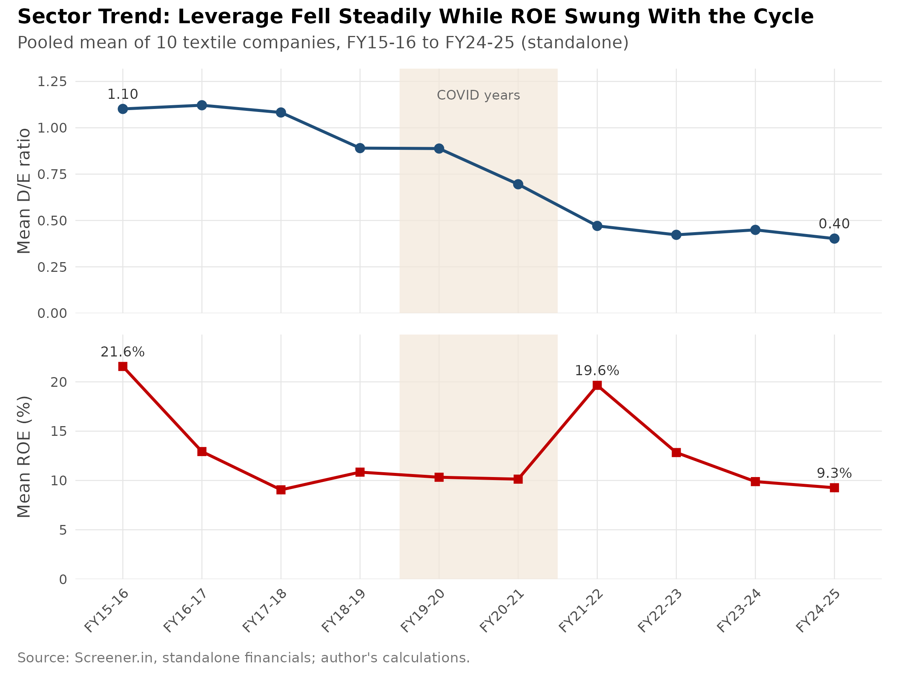
</p>

---

## Contents
- [Research questions](#research-questions)
- [Sample & data](#sample--data)
- [Methodology](#methodology)
- [Key results](#key-results)
- [Link to capital structure theory](#link-to-capital-structure-theory)
- [Robustness checks](#robustness-checks)
- [Figures](#figures)
- [Reproduce the analysis](#reproduce-the-analysis)
- [Repository structure](#repository-structure)
- [Limitations & further research](#limitations--further-research)
- [References](#references)
- [Author](#author)

---

## Research questions

1. What is the capital structure pattern (debt-equity mix) of the sample firms, both across companies and over time?
2. What determines leverage: **firm size, profitability, asset tangibility, sales growth**?
3. Does capital structure affect **firm performance** (ROE, ROA)?
4. Which theory best explains the behaviour: **Modigliani–Miller, Trade-off, Pecking Order or Agency**?
5. How do individual firms compare? Which company-specific patterns matter to an investor?

---

## Sample & data

| # | Company | Ticker | Primary business |
|---|---|---|---|
| 1 | KPR Mill | KPRMILL | Yarn, fabric, garments (vertically integrated) |
| 2 | Welspun Living | WELSPUNLIV | Home textiles: towels, bed linen, flooring |
| 3 | Indo Count Industries | ICIL | Home textiles: bed linen (export-focused) |
| 4 | Vardhman Textiles | VTL | Yarn, fabric, acrylic fibre, garments |
| 5 | Trident | TRIDENT | Yarn, terry towels, bed sheets |
| 6 | Arvind | ARVIND | Denim, woven fabrics, garments |
| 7 | Nitin Spinners | NITINSPIN | Cotton yarn, knitted & woven fabric |
| 8 | Sutlej Textiles & Industries | SUTLEJTEX | Yarn, home textiles |
| 9 | Gokaldas Exports | GOKEX | Apparel / garment exports |
| 10 | Siyaram Silk Mills | SIYSIL | Fabrics, readymade menswear |

- **Source:** [Screener.in](https://www.screener.in). It standardises the balance-sheet and P&L data that companies file with the BSE/NSE. It is the named alternative to CMIE Prowess in the assignment brief. A spot-check against Prowess showed differences only at the second decimal place.
- **Basis:** **Standalone** figures for every company, so every ratio is like-for-like.
- **Period:** FY2015-16 to FY2024-25. That gives a balanced panel of **100 firm-years**; FY2014-15 is used only as the base year for sales growth. The window covers the pre-COVID phase, the COVID shock (FY19-20, FY20-21) and the export-led recovery.
- **Raymond Ltd was excluded.** Its FY2024 demerger makes the ratios after that year incomparable, so Siyaram Silk Mills was substituted.

### Variables

| Variable | Definition | Role |
|---|---|---|
| D/E ratio | Borrowings ÷ (Equity capital + Reserves) | Capital structure |
| ROE | Net profit ÷ Total equity | Performance |
| ROA | Net profit ÷ Total assets | Performance |
| Size | ln(Total assets) | Determinant |
| Sales growth | (Sales<sub>t</sub> − Sales<sub>t−1</sub>) ÷ Sales<sub>t−1</sub> | Determinant |
| Tangibility | Fixed assets (incl. CWIP) ÷ Total assets | Determinant |
| EPS | As reported (split-adjusted) | Performance |

---

## Methodology

A descriptive-analytical design built on secondary data, in three layers:

1. **Descriptive statistics:** mean, SD, minimum and maximum, company-wise and year-wise.
2. **Pearson correlation:** relationships between the variables, and a screen for multicollinearity.
3. **Pooled OLS regression.** The model is the one given in the assignment brief:

$$ROE_{it} = \beta_0 + \beta_1 (D/E)_{it} + \beta_2\,Size_{it} + \beta_3\,Growth_{it} + \beta_4\,Tangibility_{it} + \varepsilon_{it}$$

The same model is re-estimated with ROA as the dependent variable, as a robustness check.

---

## Key results

### 1. Leverage has fallen sharply and differs widely between firms
- Pooled mean D/E fell from **1.10 (FY15-16) to 0.40 (FY24-25)**. Debt's share of sector capital fell from 51% to 23%.
- Average D/E ranges more than five-fold, from **0.27 (KPR Mill)** to **1.43 (Nitin Spinners)**.

| Company | Mean D/E | Mean ROE | Mean ROA | Mean tangibility |
|---|---:|---:|---:|---:|
| KPR Mill | 0.27 | 19.8% | 14.4% | 35.7% |
| Welspun Living | 0.78 | 14.3% | 6.3% | 41.6% |
| Indo Count Industries | 0.46 | 17.6% | 9.7% | 33.7% |
| Vardhman Textiles | 0.37 | 13.2% | 8.5% | 36.8% |
| Trident | 0.71 | 11.6% | 6.1% | 65.9% |
| Arvind | 0.70 | 6.3% | 2.9% | 47.9% |
| Nitin Spinners | 1.43 | 16.4% | 6.6% | 63.3% |
| Sutlej Textiles | 0.99 | 5.7% | 2.3% | 51.9% |
| Gokaldas Exports | 1.40 | 6.9% | 4.6% | 15.7% |
| Siyaram Silk Mills | 0.42 | 14.8% | 8.6% | 34.3% |
| **Pooled (100 obs.)** | **0.75** | **12.7%** | **7.0%** | **42.7%** |

### 2. More debt goes with lower profitability
| Pair | Pearson r |
|---|---:|
| D/E – ROE | **−0.36\*\*\*** |
| D/E – ROA | **−0.51\*\*\*** |
| D/E – Size | **−0.40\*\*\*** |
| Sales growth – ROE | **+0.41\*\*\*** |

### 3. Regression (pooled OLS, n = 100)

| Variable | ROE model β | p | ROA model β | p |
|---|---:|---:|---:|---:|
| Intercept | 0.3815 | 0.000 | 0.2087 | 0.000 |
| **D/E ratio** | **−0.0772** | **<0.001** | **−0.0482** | **<0.001** |
| Size (ln TA) | −0.0311 | 0.014 | −0.0123 | 0.037 |
| Sales growth | +0.1964 | <0.001 | +0.0993 | <0.001 |
| Tangibility | +0.0835 | 0.153 | −0.0291 | 0.288 |
| **R² / Adj. R²** | **0.335 / 0.307** | | **0.456 / 0.433** | |
| F(4, 95) | 11.99 (p < 0.001) | | 19.92 (p < 0.001) | |

**How to read this:** holding size, growth and tangibility constant, a one-unit rise in D/E comes with **7.7 percentage points lower ROE**. A 10-point rise in sales growth comes with about 2 points higher ROE. Tangibility is not significant.

<p align="center">
  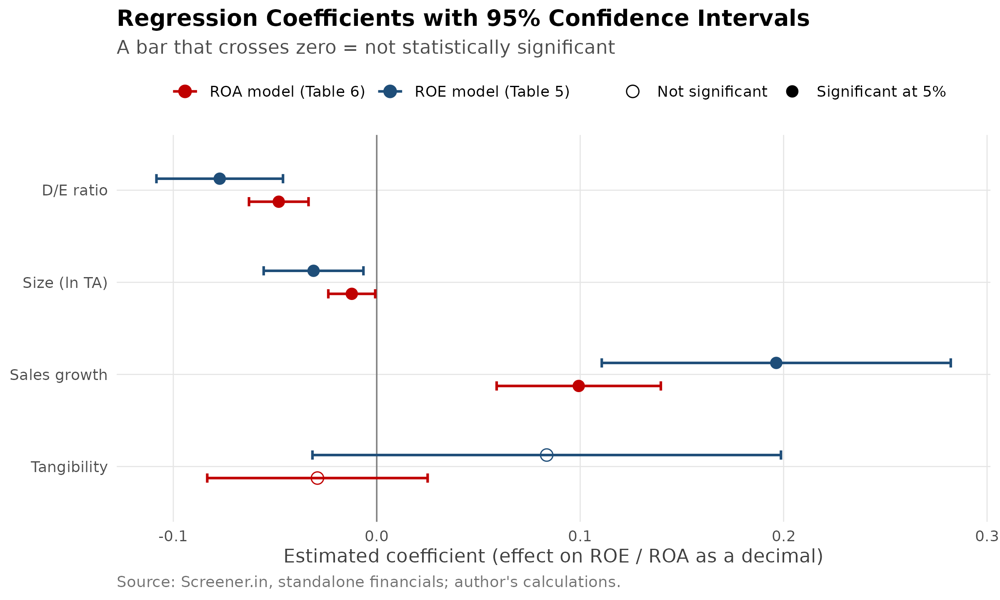
</p>

---

## Link to capital structure theory

| Theory | Prediction | Evidence here | Verdict |
|---|---|---|---|
| **Modigliani–Miller (1958)**, no taxes | Firm value and performance are independent of leverage | Leverage is clearly related to performance | ✗ Not supported. Real taxes, distress costs and information asymmetry exist. |
| **MM with taxes (1963)** | Value rises with debt (interest tax shield) | Profitable firms carry *less* debt | ✗ Not supported empirically; stays the benchmark for exams and calculations |
| **Trade-off** | A target leverage; profitability is flat or positively related to debt | Strong negative relationship; firms deleverage rather than hold a target ratio | ~ Weak |
| **Pecking Order (Myers, 1984)** | Internal funds first, so profitable and larger firms borrow less | D/E negatively related to ROE, ROA and size; debt repaid out of good-year cash flows | ✓ **Best fit** |
| **Agency (Jensen, 1986)** | Debt disciplines mature, cash-rich firms | Possible for large composites, but not the dominant pattern | ~ Partial |

---

## Robustness checks

These go beyond the assignment brief and were added to test how solid the main result is. The full working is in [`docs/ANALYSIS_NOTES.md`](docs/ANALYSIS_NOTES.md).

| Check | Result | What it means |
|---|---|---|
| **VIF** (multicollinearity) | 1.01 – 1.35 | No multicollinearity concern |
| **Breusch–Pagan** | ROE p = 0.006; ROA p = 0.34 | Heteroskedasticity in the ROE model, so robust SEs are used |
| **Robust (HC1) / firm-clustered SE** | D/E p = 0.003 / 0.002 | The D/E effect survives; Size weakens to p ≈ 0.06 (clustered) |
| **COVID dummy** (FY20, FY21) | β = −0.005, p = 0.83 | COVID worked through lower sales growth, not as a separate shock |
| **Two-way fixed effects** | D/E β = −0.112, p < 0.001 | The effect holds within each firm over time |
| **Hausman test** | χ² = 1.32, p = 0.86 | Random effects preferred, so the pooled or RE estimates are consistent |

---

## Figures

### Figures used in the report
| | |
|---|---|
| 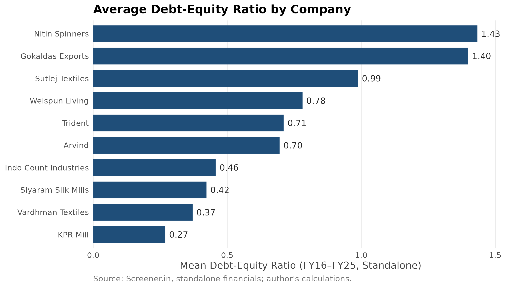 | 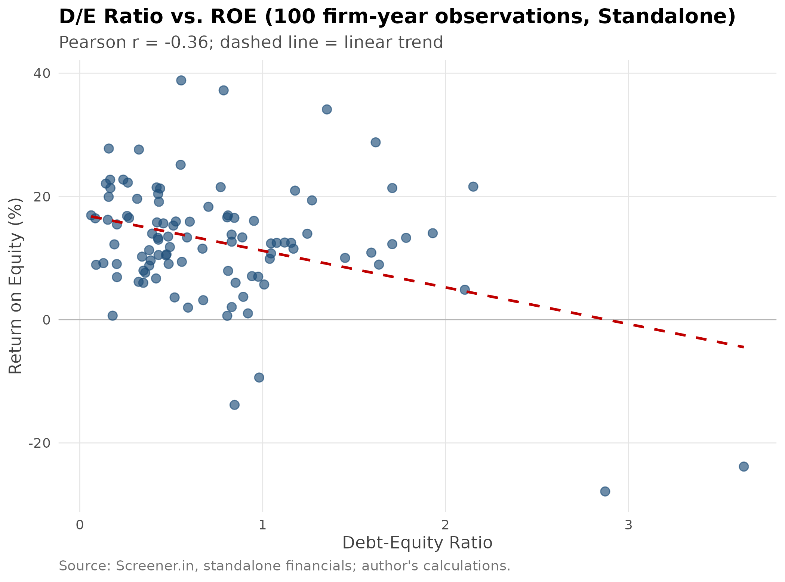 |
| **Fig 1:** Average D/E by company | **Fig 3:** D/E vs ROE, 100 firm-years |

### Additional figures
| | |
|---|---|
| 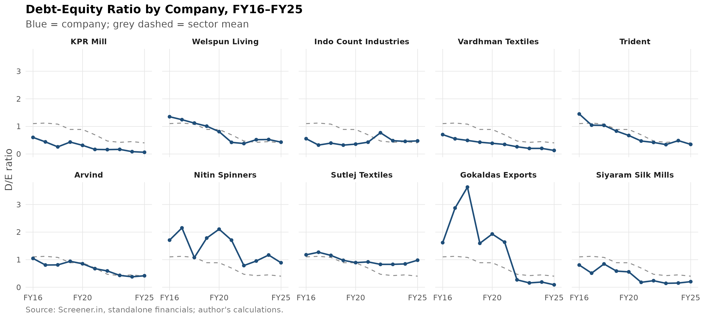 | 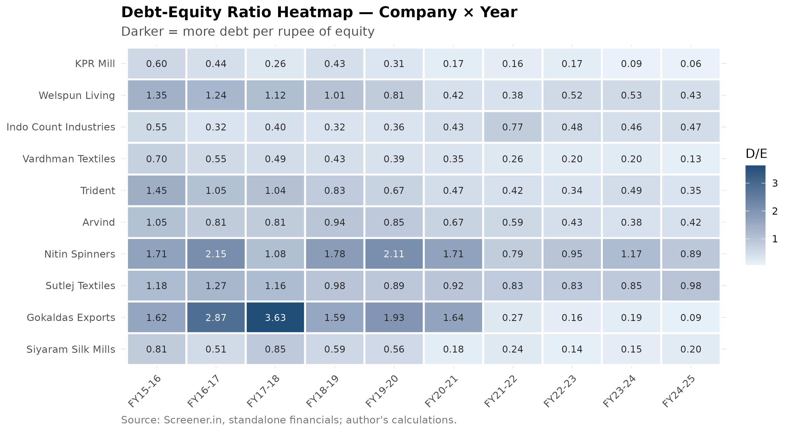 |
| **A02:** D/E trend for each company | **A03:** D/E heatmap, company × year |
| 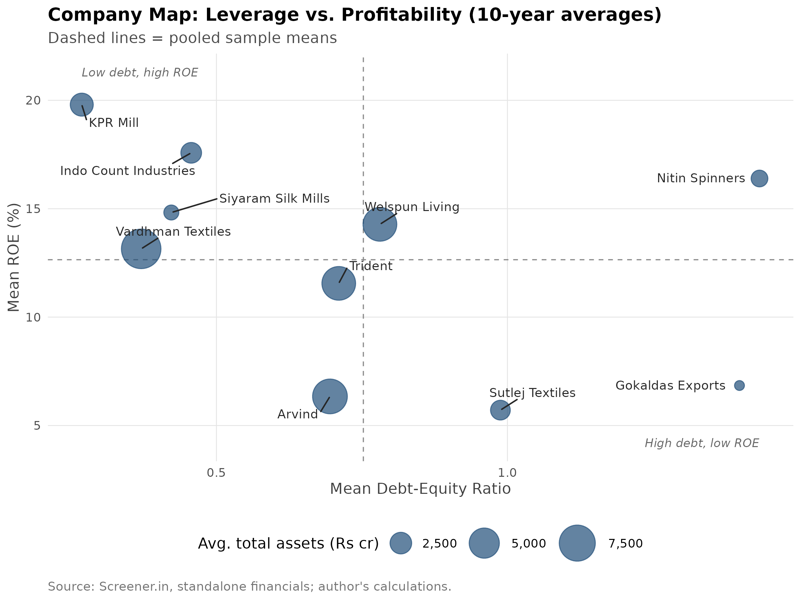 | 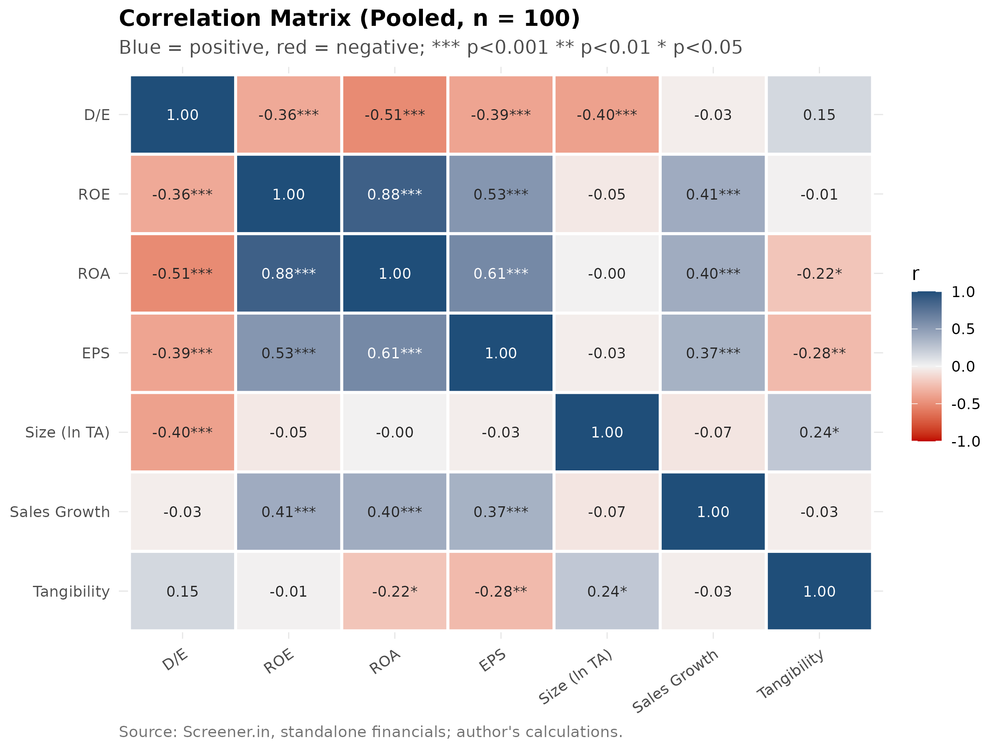 |
| **A07:** Company map, leverage vs profitability | **A06:** Correlation matrix |
| 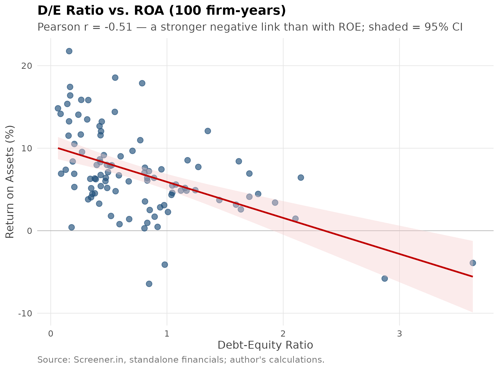 | 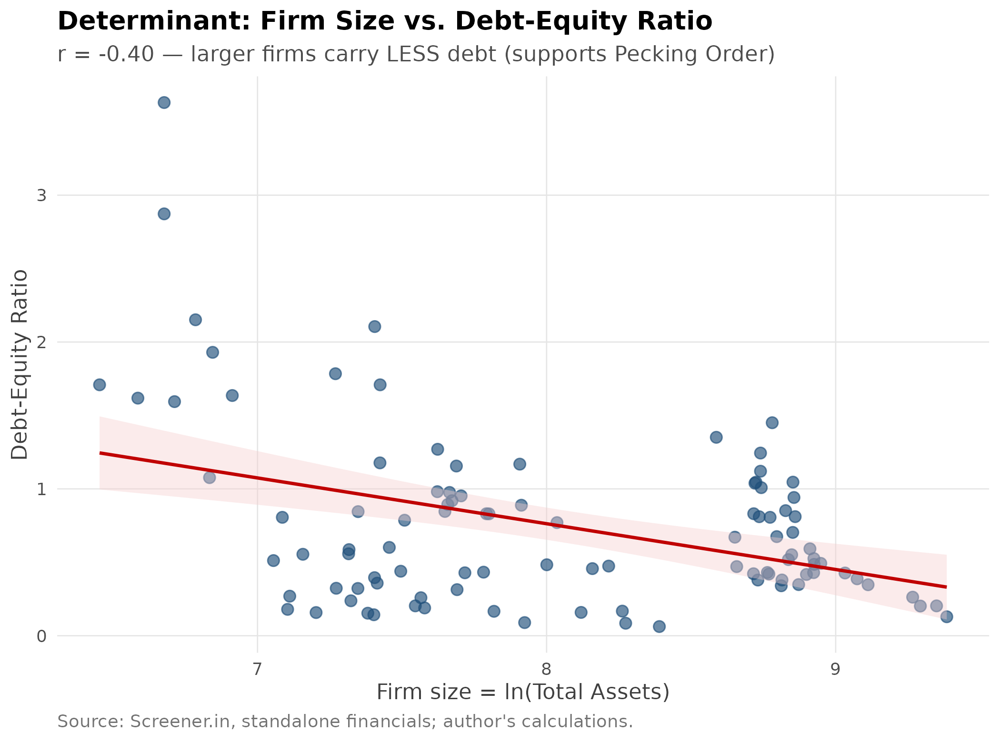 |
| **A05:** D/E vs ROA | **A08:** Firm size vs D/E |
| 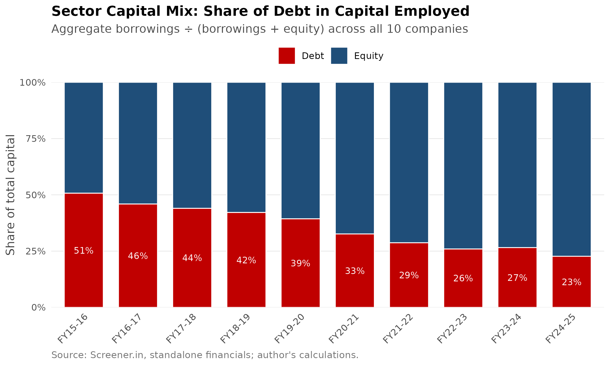 | 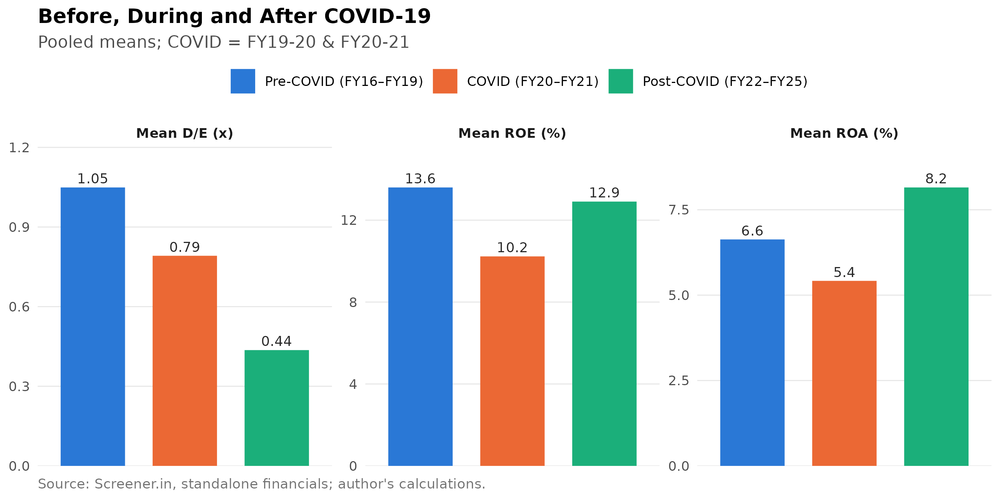 |
| **A12:** Sector capital mix | **A13:** Pre / during / post COVID |

Every figure is a 300-dpi PNG in [`output/figures/`](output/figures/). The complete list with descriptions is in [`docs/FIGURES.md`](docs/FIGURES.md).

---

## Reproduce the analysis

**Requirements:** R ≥ 4.2 (RStudio recommended). Missing packages install automatically on the first run.

```bash
git clone https://github.com/<your-username>/capital-structure-textiles-india.git
cd capital-structure-textiles-india
Rscript run_all.R
```

Or, in **RStudio**: open `capital-structure-textiles-india.Rproj`, then open `run_all.R` and click **Source**.

The whole run takes under a minute and rebuilds every table and figure in `output/`.

| Script | What it does | Output |
|---|---|---|
| `R/00_setup.R` | Packages, colours, chart theme | — |
| `R/01_data_prep.R` | Builds the 100-row ratio panel from the raw data | `ratios_panel.csv` |
| `R/02_descriptive_stats.R` | Company-, year- and period-wise statistics (Table 3) | `desc_*.csv` |
| `R/03_correlation.R` | Correlation matrix and p-values (Table 4) | `correlation_*.csv` |
| `R/04_regression.R` | OLS (Tables 5–6), diagnostics, robust SEs, COVID dummy, fixed effects | `regression_*.csv/.txt` |
| `R/05_report_figures.R` | Figures 1–3 | `output/figures/report/` |
| `R/06_additional_figures.R` | Figures A01–A13 | `output/figures/additional/` |
| `R/07_export_workings.R` | All tables in one workbook | `R_Workings.xlsx` |

**R packages:** dplyr, tidyr, readr, ggplot2, scales, ggrepel, patchwork, lmtest, sandwich, car, plm, writexl.

---

## Repository structure

```
capital-structure-textiles-india/
├── README.md
├── LICENSE
├── CITATION.cff
├── run_all.R                     # one-click reproduction
├── capital-structure-textiles-india.Rproj
├── data/
│   ├── raw_data.csv              # Screener.in standalone financials, FY2015–FY2025 (Rs crore)
│   ├── Chandan_CapitalStructure_Workings.xlsx   # original Excel workings (live formulas)
│   └── README.md                 # data dictionary
├── R/                            # analysis scripts, run in numbered order
├── output/
│   ├── figures/report/           # Figures 1–3
│   ├── figures/additional/       # Figures A01–A13
│   └── tables/                   # CSV tables, R_Workings.xlsx, full regression output
└── docs/
    ├── ANALYSIS_NOTES.md         # technical + plain-language explanation of every result
    └── FIGURES.md                # figure catalogue and where each fits in the report
```

---

## Limitations & further research

**Limitations**
- The sample is small and covers a single sector (10 firms, 100 firm-years), so results may not generalise to Indian industry as a whole.
- Screener.in groups balance-sheet items, so a current ratio could not be derived and liquidity is not modelled.
- Leverage is measured at **book value**; market-value leverage could differ, especially for fast-growing firms.
- Qualitative factors are not captured: management risk appetite, promoter changes, market timing.

**Further research**
- A multi-sector panel to test whether the results hold beyond textiles.
- Market-value leverage and liquidity ratios, using CMIE Prowess.
- A dynamic panel (e.g. GMM) to test whether firms adjust toward a target leverage ratio.

---

## References

- Modigliani, F., & Miller, M. H. (1958). The Cost of Capital, Corporation Finance and the Theory of Investment. *American Economic Review*, 48(3), 261–297.
- Modigliani, F., & Miller, M. H. (1963). Corporate Income Taxes and the Cost of Capital: A Correction. *American Economic Review*, 53(3), 433–443.
- Kraus, A., & Litzenberger, R. H. (1973). A State-Preference Model of Optimal Financial Leverage. *Journal of Finance*, 28(4), 911–922.
- Jensen, M. C., & Meckling, W. H. (1976). Theory of the Firm: Managerial Behavior, Agency Costs and Ownership Structure. *Journal of Financial Economics*, 3(4), 305–360.
- Myers, S. C. (1984). The Capital Structure Puzzle. *Journal of Finance*, 39(3), 574–592.
- Myers, S. C., & Majluf, N. S. (1984). Corporate Financing and Investment Decisions When Firms Have Information That Investors Do Not Have. *Journal of Financial Economics*, 13(2), 187–221.
- Jensen, M. C. (1986). Agency Costs of Free Cash Flow, Corporate Finance, and Takeovers. *American Economic Review*, 76(2), 323–329.
- Pandey, I. M. (2015). *Financial Management*. Vikas Publishing House.
- Chandra, P. (2019). *Financial Management: Theory and Practice*. McGraw Hill Education.
- Bhardwaj, S. (2026, August). Textile stocks weave a comeback. *The Economic Times Wealth*.
- Screener.in (2026). Standalone financial statements of the 10 sample companies. https://www.screener.in

---

## Author

**Chandan**, B.Com (Semester 3), Division D, Roll No. 5822
Subject Teacher: Dr. Tessy Thadathil · Academic year 2026–27

Code is released under the [MIT License](LICENSE). The financial data are drawn from publicly filed statements via Screener.in and are included for academic, non-commercial use only.
